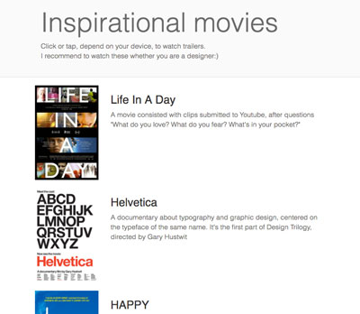

Python source code to configure html file that shows youtube trailers retrieving data saved in a python file.

## Usage
### Commands: 
This command will open trailers.html in your webbrowser.
```
$ python start.py
```

### Creating Movie instance and generating trailers.html:
You can set the page title in `start.py`
```python
page_title = "Your page title"
```
This page title will be used in the following:
- Name of the generated html file: your_page_title
- head title of the generated html page
- Heading of the generated page 
Caution: Don't change papge_title, this cariable will be passed to a function to generate html 

You can craete Movie instance with 4 variables in `start.py`
```python
instance_name = media.Movie(arg1, arg2, arg3, arg4) 
```
Variables:
- `arg1`: {string} name of the movie: You can access this variable`instance\_name.title` in `generateHTML.py`
- `arg2`: {string} description of the movie: You can access this variable`instance\_name.storyline` in `generateHTML.py`
- `arg3`: {string} path to the image of the movie poster: You can access this variable`instance\_name.poster\_image\_url ` in `generateHTML.py`
- `arg4`: {string} Youtube url of the movie trailer: You can access this variable`instance\_name.trailer\_youtube\_url` in `generateHTML.py`
Caution: arg4 need refer Youtube url, because it actually works with its video ID 

Then add these instance name to a list 
```python
movies = [instance_name, instance_name2, instance_name3,....]
```

So the following function will generate html page.
```python
generateHTML.open_movies_page(movies)
```

### What other files do:
- `media.py`: it defines Movie class, including variables and methods.
- `generateHTML.py`: it generates trailers.html retrieving data in start.py.

### Stying trailers.html:
The basic css is from [bootstrap](http://getbootstrap.com/css/).
And also you can customize css in `css/style.css`


## Licence
[MIT Licence](https://choosealicense.com/licenses/mit/) © [Yukino Kohmoto](http://yukinokoh.github.io/portfolio/)

You can find the original repository here: 
https://github.com/adarsh0806/ud036_StarterCode/blob/master/fresh_tomatoes.py


